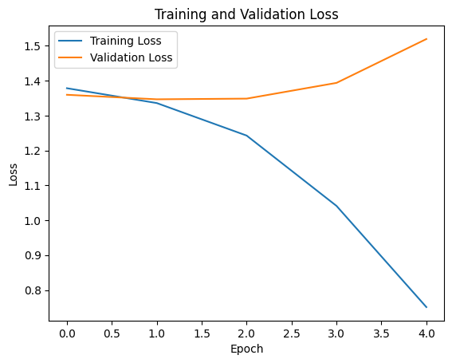

# CSE151A_FINAL_PROJECT
# MS2

Dataset contains 3313 observations and 9 features.
The goal of this project is to predict Laid off financial period. We add a new target column based on 'date' feature.

Numerical features data exploration:
- there are only 3 features are numerical. total_laid_off, percentage_laid_off, funds_raised
- total_laid_off contains 34 % missing values, percentage_laid_off contains 35 % missing values, funds_raised contains 11 % missing values
- Based on Plots for numerical features:
(1) For total_laid_off, the plot present Uniform distribution
(2) For percentage_laid_off, the plot present right skewed distribution
(3) For funds_raised, the plot present Uniform distribution
(4) The correlation between numerical features are not strong. Weak negative relationship between total_laid_off and percentage_laid_off; Weak positive relationship between total_laid_off and funds_raised;Weak negative relationship between funds_raised and percentage_laid_off; The highest relationship is between funds_raised and total_laid_off. The highest correlation between target 'quarters' is negative relationship between quarters and total_laid_off.
(5) There is no evident relationship between target and numerical features from pairplot

Categorical features data exploration:
- Only few missing values in location, industry, stage. However 'stage' contains a lot of Unkown value
- There are 6 categorical features: company, location, industry, stage, country, quarters(target)

Observation based on plots:
- Top 5 frequent industry in the datasets are:'Finance', 'Retail', 'Healthcare', 'Transportation', and other
- Top 5 frequent location in the datasets are: 'SF Bay Area', 'New York City', 'Boston', 'Bengaluru', 'Los Angeles',
       'Seattle'
- Top 5 frequent stage in the datasets are: 'Post-IPO', 'Unknown', 'Series B', 'Series C', 'Series D'
- Top 5 frequent country in the datasets are: 'United States', 'India', 'Canada', 'United Kingdom', 'Germany'
- Top 5 frequent company in the datasets are: 'Amazon', 'Uber', 'Spotify', 'Loft', 'Convoy'
- The most frequent quarter in the datasets is: Q2

Analysis based on heatmap:
- Relationship between industry and quarters. Layoffs in Finance industry occurs in quarter 2.
- Relationship between stage and quarters. Layoffs in stage post-ippo occurs in quarter 1.
- Relationship between locations and quarters. Layoffs in SF bay area occurs in quarter 2.
- Relationship between locations and quarters. Layoffs based on United States occurs in quarter 2.
- Relationship between company and quarters. Layoffs in Amazon occurs in quarter 2 and 4.

**Summary**:
- the dataset is balanced in term of target, the amount of each category of labels is similar.
- too many missing values in numerical features
- too many Unkown values in categorical feature 'stage'

**Next steps**:
- Handle missing values by (1)fill Null values with mean (2) drop rows contain NaN and add more datapoints from backup datasets.
- Normalize numerical features with min max normalization or z score standardization
- Encode categorical features with one hot encoding
- Try baseline model logistic regression.

-------------------------------------

# MS3

**Conclusion**

- Conclusion for Baseline model: Observing the difference in training error and test error, we believe the model has a sign of over fitting since the training error is much lower than the test error. In the fitting graph, the model may only successfully trace the pattern of training data, and is unable to predict the general pattern on unseen test data. The reason might be that the model is capturing too much noise in the training data and took such information into account of making predictions.
- Possible improvement of Baseline model: In order to improve the issue of over-fitting we decide to implement the sequential model with more layers, different number of nodes, hidden layers and activation function. By adding layers into the model, we believe such an issue can be improved.Regarding the baseline logistic regression, it fails because it's inability to capture the complex pattern in between categories, using hyperparameter tuning with different learning rate and solver might fix this problem.

**Next steps**:
- For the Next two models, we are thinking about exploring binary categorization and multi-class categorization with ANN/CNN> In which we are going to use activation functions 'softmax' and 'sigmoid' correspondingly, to see whether it is best to use  binary categorization and multi-class categorization on our numerical continuous but actually discrete target data 'quarters'.
- one possible model is multiclass support vector machine. Because the dataset for this project has high dimensional features and svm usually performs well in high dimensional space.Svm is also good at handling non linear relationship with different kernel functions and resistant to overfitting.
- Another possible model will be Gradient Descent boosting. Because the ensemble techniques that build on multiple decision trees can lead to better performance and capture comple relationship in the dataset. And this model usually less prone to overfitting.

-------------------------------------

# MS4

In this milestone you will focus on building your second model. You will also need to evaluate your this model and see where it fits in the underfitting/overfitting graph.

1. Evaluate your data, labels and loss function. Were they sufficient or did you have have to change them.
- For previous milestone, we tried neural network for multiclass classification and we processed the target column with one hot encoder. But in this milestone, we tried SVM model with one vs rest approach. So we changed the target column back to the original shape, one column with four discrete labels.

2. Train your second model

- In this milestone, we tried model SVM and Random Forest. We mainly focus on the Random Forest.

3. Evaluate your model compare training vs test error

4. Where does your model fit in the fitting graph, how does it compare to your first model?
In this milestone, we use models like SVM and Random Forest, they do not have explicitive iterative training epochs as neural network. But one thing we did to visualize overfitting through graph was to hypertuning the model with different model complexity and see the training and test accuracies changes over iterations. If the test accuarcy decrease while training accuarcy increases over iteration of hyper tuning, then there indicates overfitting. 

5. Did you perform hyper parameter tuning? K-fold Cross validation? Feature expansion? What were the results?

5. What is the plan for the next model you are thinking of and why?

6. Update your readme with this info added to the readme with links to the jupyter notebook!

7. Conclusion section: What is the conclusion of your 2nd model? What can be done to possibly improve it? How did it perform to your first and why?

Please make sure your second model has been trained, and predictions for train, val and test are done and analyzed.

