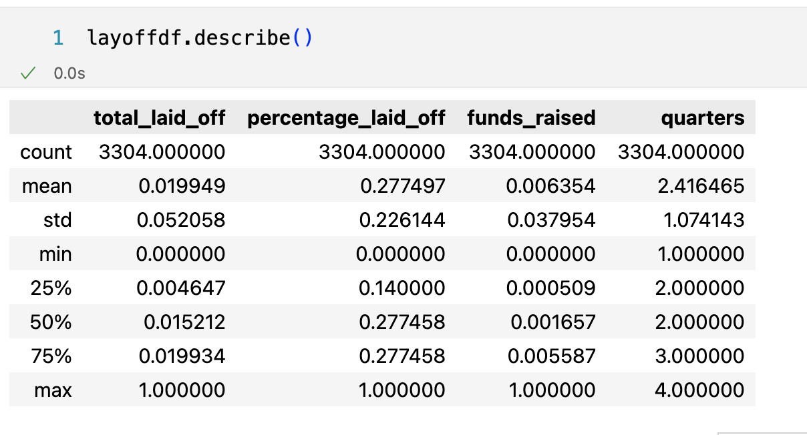
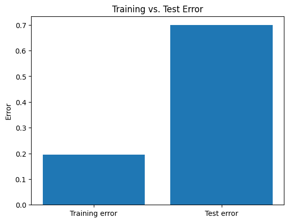
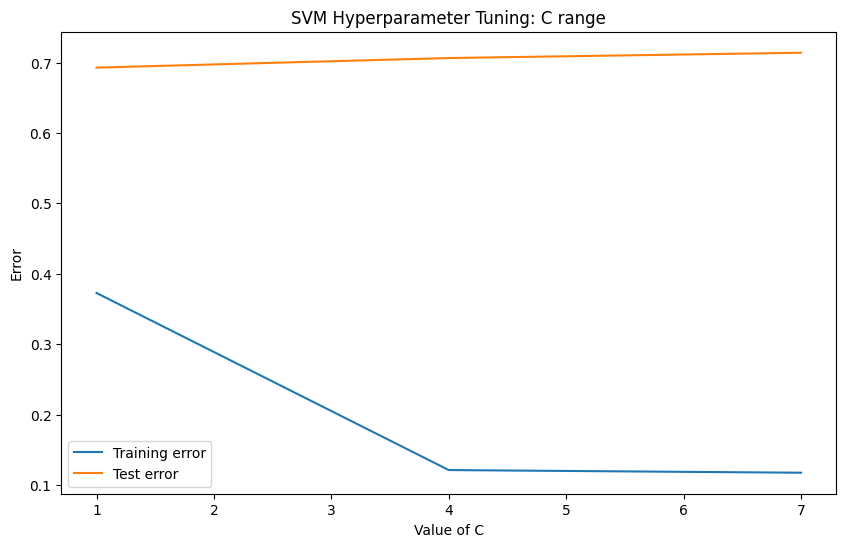
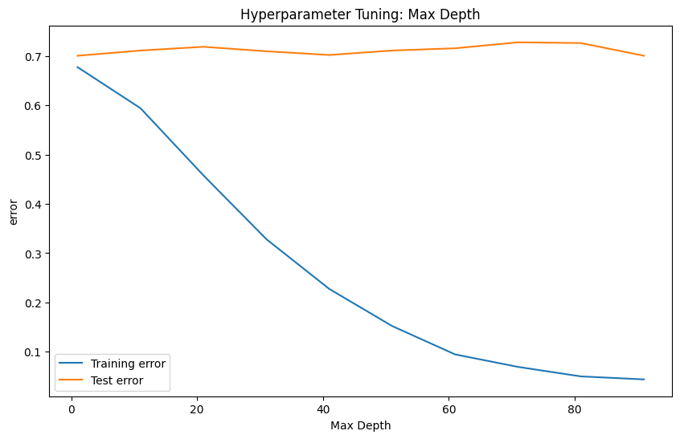
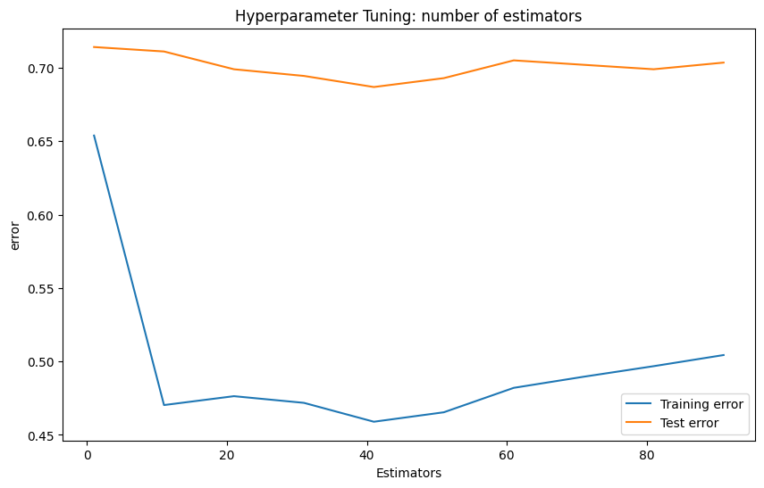
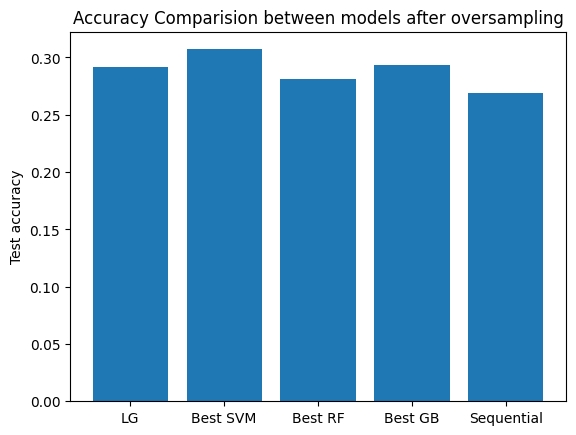

# Previous Milestone README Submissions and Final Code file
please see the files:
- previous_milestone_readme.md
- final_project.ipynb

# INTRODUCTION

Layoffs have become a sensitive but recurring topic after covid-19. Especially in the field of technology, undergrads like us are frequently receiving information about our ideal future working companies going through massive layoff. Layoff shows it’s tendency of growing after covid-19 which caused financial shortage and lack of fundings. The emergence of Chat GPT and other AI tools give companies more motivation to shift from human resources to investments in AI. Also, critics claim 2023’s massive layoff generated rewarding rewards from wall street such as the growth of stock price and thus leads to the loop of layoff increasement. To further understand the correlation behind layoff and various aforementioned factors, we carefully selected a dataset consist of companies’ information with detailed layoff record from 2019 to 2023, aiming to provide insight for undergrads and individuals who concerns what factors causes a company to consider layoff and the specific time of their action.


# METHOD


## Exploration results

Dataset contains 3313 observations and 9 features.
The goal of this project is to predict Laid off financial period. We add a new target column based on 'date' feature.

*Numerical features data exploration*:
- there are only 3 features are numerical. total_laid_off, percentage_laid_off, funds_raised
- total_laid_off contains 34 % missing values, percentage_laid_off contains 35 % missing values, funds_raised contains 11 % missing values
- Based on Plots for numerical features:
(1) For total_laid_off, the plot present Uniform distribution
(2) For percentage_laid_off, the plot present right skewed distribution
(3) For funds_raised, the plot present Uniform distribution
(4) The correlation between numerical features are not strong. Weak negative relationship between total_laid_off and percentage_laid_off; Weak positive relationship between total_laid_off and funds_raised;Weak negative relationship between funds_raised and percentage_laid_off; The highest relationship is between funds_raised and total_laid_off. The highest correlation between target 'quarters' is negative relationship between quarters and total_laid_off.
(5) There is no evident relationship between target and numerical features from pairplot

*Categorical features data exploration*:
- Only few missing values in location, industry, stage. However 'stage' contains a lot of Unkown value
- There are 6 categorical features: company, location, industry, stage, country, quarters(target)

*Observation based on plots*:
- Top 5 frequent industry in the datasets are:'Finance', 'Retail', 'Healthcare', 'Transportation', and other
- Top 5 frequent location in the datasets are: 'SF Bay Area', 'New York City', 'Boston', 'Bengaluru', 'Los Angeles',
       'Seattle'
- Top 5 frequent stage in the datasets are: 'Post-IPO', 'Unknown', 'Series B', 'Series C', 'Series D'
- Top 5 frequent country in the datasets are: 'United States', 'India', 'Canada', 'United Kingdom', 'Germany'
- Top 5 frequent company in the datasets are: 'Amazon', 'Uber', 'Spotify', 'Loft', 'Convoy'
- The most frequent quarter in the datasets is: Q2

*Analysis based on heatmap*:
- Relationship between industry and quarters. Layoffs in Finance industry occurs in quarter 2.
- Relationship between stage and quarters. Layoffs in stage post-ippo occurs in quarter 1.
- Relationship between locations and quarters. Layoffs in SF bay area occurs in quarter 2.
- Relationship between locations and quarters. Layoffs based on United States occurs in quarter 2.
- Relationship between company and quarters. Layoffs in Amazon occurs in quarter 2 and 4.

## Preprocessing steps
- Handle missing values: use imputation to replace missing numerical values with the mean of their respective columns. Since categorical values only have 9 missing values. We decide jsut drop the rows.
- Rescale data: use MinMaxScaler to normalize the numerical features of the dataset to a range between 0 and 1.
- Transform categorical features: use one hot encoder.

## Model 1
a. Logistic Regression

```python
model_lg = LogisticRegression(multi_class='multinomial', solver='lbfgs', max_iter=1000, random_state=42)
```

b. Sequential Model

- For this neural network model, one extra step before training the model is to preprocess the label with one hot encoder. We also try to optimize the model performance with different activation functions, number of nodes, layers, loss function and early stopping.

```python
def build_model():
    sequential_model = Sequential([
        Dense(64, activation='relu', input_dim=X_train.shape[1]),
        Dense(32, activation='relu'),
        Dense(4, activation='softmax')
    ])
    sequential_model.compile(optimizer='adam', loss='categorical_crossentropy', metrics=['accuracy'])
    return sequential_model

sequential_model = KerasClassifier(build_fn=build_model, epochs=100, batch_size=32, verbose=0)
early_stopping = EarlyStopping(monitor='val_loss', patience=3, restore_best_weights=True)
history = sequential_model.fit(X_train, y_train, epochs=100, batch_size=32, validation_split=0.2, callbacks=[early_stopping])
```

## Model 2
a. SVM
- For this model, we need to have an extra step to transform the dataset. Previously, we transformed the label with one hot encoder for training neural network. But this format is not suitable for training SVM. And the goal of this project is to multi class classfication, we decided to use one versu rest. We experiment two basic kernel functions: linear and rbf. After we try these two basic models, we also perform hyper tuning with randomized search.
```python
svm_linear = SVC(kernel='linear', decision_function_shape='ovr')
svm_rbf = SVC(kernel='rbf', decision_function_shape='ovr')

param_dist = {'C': [0.1, 1, 10],
              'gamma': [1, 0.1, 0.01],
              'kernel': ['linear','rbf']}

svm = SVC(decision_function_shape='ovr',random_state=42, probability=True)
random_search = RandomizedSearchCV(svm, param_distributions=param_dist, n_iter=10, cv=3, random_state=42, n_jobs=-1, scoring='accuracy')
random_search.fit(X_train, y_train)
best_svm = random_search.best_estimator_

```

b. Random Forest

- For this model, we follow similar steps. We first try the defualt model imported from the library, then optimize it with randomized search. For this project, we choose number of estimators and max depth as parameters for tuning. The number of iteration for searching is 10 and cross validation is 3. The scoring for searching is accuracy. After the hyperparameter tuning is done, we choose the best estimator for prediction.

```python

param_dist = {
    'n_estimators': [10, 20,30,40],
    'max_depth': [None, 10, 20,30],
}

rf_clf = RandomForestClassifier(random_state=42)
rnd_search = RandomizedSearchCV(rf_clf, param_distributions=param_dist, n_iter=10, cv=3, scoring='accuracy', random_state=42, n_jobs=-1)
rnd_search.fit(X_train, y_train)
best_params = rnd_search.best_params_
best_score = rnd_search.best_score_
rf_best = RandomForestClassifier(**best_params, random_state=42)
```

## Model 3
a. Gradient Boosting

- The training process for this model is similar to Random Forest in the second experiment. And we use the same hyperparameter tuning method and values. After the tuning is done, we use the best estimator for prediction.

```python
param_dist = {
    'n_estimators': [10, 20,30,40],
    'max_depth': [None, 10, 20,30]
}
gb_clf = GradientBoostingClassifier(random_state=42)

random_search = RandomizedSearchCV(estimator=gb_clf, param_distributions=param_dist, cv=3, n_jobs=-1, scoring='accuracy')

random_search.fit(X_train, y_train)

gb_best = random_search.best_estimator_
```

b. Oversampling

- After experiments with different models, we do not see big difference in the results. So we decide to make change to the dataset with oversampling. We use RandomOverSampler to add more copies to minority classes.

```python
from collections import Counter
from imblearn.over_sampling import RandomOverSampler
print('Original dataset shape %s' % Counter(y_train))
ros = RandomOverSampler(random_state=42)
X_res, y_res = ros.fit_resample(X_train,y_train)
print('Resampled dataset shape %s' % Counter(y_res))
```

c. Ensemble Models (Voting)

- After we try oversampling the dataset, we decide to apply the ensemble techniques voting to improve the performance. We use voting classifier to train on multiple models and predict the target based on the average of probability given to that class. We do not include the sequential model in this case because of the incompability tensorslow, and based on previous experiment sequential model shows the lowest accuracy, so we believe that excluding sequential model in this experiment would not make big difference.


```python
from sklearn.ensemble import VotingClassifier

voting_clf = VotingClassifier(
    estimators=[
        ('lr', model_lg), ('svm', best_svm),
        ('dtrf', rf_best), ('gb', gb_clf)    ],
    voting='soft'
)

voting_clf.fit(X_train, y_train)
```


# RESULTS
## Prepocessing Results


<small><strong>Fig. 1 Handle Missing Values:</strong> This image illustrates features company, location, industry, total_laid_off, percentage_laid_off, stage, country, funds_raised, and quarters all no longer have missing value. </small>



<small><strong>Fig. 2 Rescale Data:</strong> This image shows numerical features total_laid_off, percentage_laid_off, stage, country, funds_raised, and quarters after implementing feature rescale. All data are scaled in between 0 and 1 with the same number of count.</small>


<small><strong>Fig. 3 Transform categorical features: </strong> This image shows categorical features after changing categorical data into numeric values, concatenated with numerical features. </small>


## Model 1 results

<small><strong>Fig. 4 Error of Training and Testing set of Logistic Regression Model: </strong> This image is a histogram showing the error of train dataset and test dataset after fitting X into a logistic regression model. The error resulted by fitting training set is 0.2, while the error resulted by fitting testing set is 0.7. </small>


<small><strong>Fig. 5 Trend of Training and Validation loss of Sequential Model: </strong> This image is a line graph comparing the change in loss over epoch by fitting training dataset and validation dataset to a sequential model. The blue line indicates the trend of change in the loss of training dataset, which shows a tendency of decreasing from 1.4 to 0.5; while the orange line indicates the trend of change in the loss of fitting validation dataset to the sequential model, which shows a tendency of increasing from 1.4 to 1.7. </small>


## Model 2 results
### SVM

<small><strong>Fig. 6 Error over the change of C value in SVM hyperparameter tuning:  </strong> The graph illustrates the change in error in testing dataset and training dataset during SVM hyperparameter tuning of changing C value. The blue line indicates the trend of change in the error of training dataset, which shows a tendency rapid decreasing from 0.38 to 0.12 followed by a trend of stabilizing around 0.11; while the orange line indicates the trend of change in the error of testing dataset which shows a relatively stable error rate around 0.7.  </small>


<small><strong>Fig. 7 Error over the change of Gamma value in SVM hyperparameter tuning:  </strong> The graph illustrates the change in error in testing dataset and training dataset during SVM hyperparameter tuning of changing gamma value. The blue line indicates the trend of change in the error of training dataset, which shows a tendency rapid decreasingfrom 0.53 to 0.15 following a tendency of stabilization around 0.15; while the orange line indicates the trend of change in the error of testing dataset which shows a trend of slight increase from 0.068 to 0.71.  </small>

### Random Forest


<small><strong>Fig. 8 Error over the change of Max depth in Random Forest Model hyperparameter tuning:  </strong> The graph illustrates the change in error in testing dataset and training dataset during Random Forest Model hyperparameter tuning by changing max depth. The blue line indicates the trend of change in the error of training dataset, which shows a tendency rapid decreasing from 0.7 to under 0.05; while the orange line indicates the trend of change in the error of testing dataset which shows a relative stable high error at 0.7.  </small>


<small><strong>Fig. 9 Error over the change of Number of Estimators in Random Forest Model hyperparameter tuning:  </strong> The graph illustrates the change in error in testing dataset and training dataset during Random Forest Model hyperparameter tuning by changing the numbers of estimators. The blue line indicates the trend of change in the error of training dataset, which U-shape change, in consist of a rapid decrease from 0.65 to 0.47, followed by a smooth increase from 0.47 to 0.50; while the orange line indicates the trend of change in the error of testing dataset which shows a relative stable high error rate above 0.7.  </small>

## model 3 results
### Gradient Boosting


<small><strong>Fig. 10 Error over the change of Max depth in hyperparameter tuning of Gradient Boosting:  </strong> The graph illustrates the change in error in testing dataset and training dataset during Gradient Boosting hyperparameter tuning by changing max depth. The blue line indicates the trend of change in the error of training dataset, which shows a tendency rapid decreasing from 0.68 to around 0.03, followed by a tend of stabilization around 0.02; while the orange line indicates the trend of change in the error of testing dataset which shows a relative stable high error at 0.7.  </small>


<small><strong>Fig. 11 Error over the change of Number of Estimators in Gradient Boosting hyperparameter tuning:  </strong> The graph illustrates the change in error in testing dataset and training dataset during Gradient Boosting hyperparameter tuning by changing the numbers of estimators. The blue line indicates the trend of change in the error of training dataset, which shows a tendency rapid decreasing from 0.48 to around 0.02, followed by a tend of stabilization around 0.02; while the orange line indicates the trend of change in the error of testing dataset which shows a relative stable high error at 0.7.   </small>

### Oversampling


<small><strong>Fig. 12 Comparison between the Accuracy of models after Oversampling:  </strong> This graph is a histogram showing the accuracy of 5 models. Logistic Regression model has a accuracy of 0.29; the best SVM model has a accuracy of 0.31; the best Random Forest Model has a accuracy of 0.27; the best Gradient Boosting model has a accuracy around 0.30; the best sequential model has a accuracy around 0.27.  </small>


### Ensemble Voting Classfier


<small><strong>Fig. 13 Report of Ensemble Voting Classifier:  </strong> This chart demonstrates the precision, recall, f1-score, and support value of the ensemble voting classifier. With a overall accuracy of 0.33. </small>


### Result table
| Models |  #Training Accuracy | #Test Accuracy  |
| ------- | --- | --- |
| Logistic Regression | 0.804 | 0.301 |
| Sequential Model | 0.368 | 0.308 |
| Best SVM | 0.393 | 0.319 |
| Best Random Forest | 0.539 | 0.308 |
| Best Gradient Boosting | 0.741 | 0.319 |
| Voting Classifier | 0.645 | 0.329 |

- Overall, the voting classifier shows the highest test accuarcy among all the models, then second best model is SVM and Gradient Boosting models. The model we try in the third experiment has the highest score. However, all the models present relatively low accuracies in testing, but they have relatively high accuracies in training. This show that the potential overfitting. Another observation about the results is, all the plots for hyperparameter tuning present similar pattern. They show that the model are not improving with any values of the different parameters.


# DISCUSSION

## Data Exploration Discussion
- In this section we use df.describe() function to have a general idea about the values in the dataframe. Then we do data visualization with histplot for the numerical features and categorical features. We use visualization because it is helpful to see the distribution of numerical data. Then we use correlation plot and correlation matrix to see any potential relationship between features, because this helps to improve the model performance in the later steps of this project, the last step we do in data exploration is checking the frequency of categorical data, this is important because we want to see whether there is any imbalanced informaiton in the features data and the label.

## Prepocessing Discussion
a. handle missing values
- we notice there are missing values in the dataset, and missing values can lead to possible low performance in model training, so we decide to handle the missing values by using the statistic mean of each numerical data. Since numerical data contains a big amount of missing values,total_laid_off contains 34 % missing values
percentage_laid_off contains 35 % missing values
funds_raised contains 11 % missing values. We do not want to simply remove the corresponding rows, because it will cause information loss. We choose to impute with mean instead of 0, because we think 0 cannot be a representative value of the dataset. However, filling with mean also has disadvantage, which does not reflect the real situation if we want to apply the result of the project to real world scenario.


b. Rescale data
- After we finished filling the missing values, we observe the data values again and notice the all the numerical features have different minimum and maximum range. So we rescale all the elements with normalizaiton and make them lie between 0 and 1.

c. Transform categorical features
- The dataset contains a mix of numerical and categorical information. Decision trees can work with input without transformation, however some models like logisctic regression cannot process with categorical data directly. So we decide to use one hot encoder to convert strings into numerical values. However, the drawback of this is it generates a big quantity of new variables and causes possible multicollinearity among variables and lower the model's accuracy and slows the training process and adds more complexity.


## Model 1 Discussion
a. Logistic Regression

- We use this model as our first model because the complexity of this model is simple compared to other advanced models, so we want to have the prediction of this model as baseline. Since our task is multiclass prediction, so we use multinomial logistic regression because our labels is categorical equivalent. But one requirement of this model is that it needs large sample size which we realize in the later stage. But one thing that suprises us is this model predicts the highest training accuracy among all the models we try. But this might also implies overfitting because testing accuracy does not increase overtime.

b. sequential Model

- After we try multinomial logistic regression, we decide to try sequential model, because neural network requires less statistical training and is able to detect complex nonlinear relationships between features and labels. In this model, we use categorical_crossentropy as the loss function, which can be used in any kind of classification problem. We use adam optimizer because it converges faster than SGD. We only implement four layers due to the long waiting time during training. We use relu for hidden layers because we want to add nonlinearity relationship during trianing and softmax in the output layer because we want to maximizes the probability of each class in a multiclass prediction task. However the training loss and validation loss plot does not show a fair performance, and the training accuracy of this model is the lowest among the others, it might be due to the a small amount of layers we implement.


## Model 2 Discussion
a. SVM

- Since sequential model did not perform well on the task, we raise the assumption that it might be due the high dimentionality of the encoded dataset. So we decide to experiemnt with SVM. There are two apporach for svm to break the multiclass tasks into binary classification task, we choose one to rest. In this approach, SVM set a bianry classfier for each class. However, we notice that during hyperparameter tuning, the testing error curve does not show any change over time. We think that even if svm is good at handling high dimentional dataset, it might struggle with the underlying relationship in the dataset. But the good news is we have new progress in term of performance,  the test accuracy of this model is the best one compared with logistic regression and sequential model.

b. Random Forest
- We decide try to use ensemble technique, since random forest generally outperform that other models in multiclass prediction problem. This model has more ability to capture the underlying relaitonship and less prone to overfitting compared to the previous models we try. Plus it works better with dataset that contain both numerical and categorical features. However, this model fails our expectation again, the hyper parameter tuning plot shows poor performance overtime, and random forest has lower accuracy compared to svm. Our assumption about this situation is that svm is good at handling high dimentional dataset and less prone to overfitting, while decision tree is less capable in this aspect. Also, the dataset contains imbalanced class which might be more chanllenging for random forest.


## Model 3 Discussion
a. Gradient Boosting

- Given the performance of decision tree, we decide to try Gradient Boosting as our last model. Because this model generally has better performance than decision tree and is trained by sequentially by learning the error from previous splits. We hypertune the parameters for both decision tree and gradient boosting. The hyperparameters tuning plots present similar pattern as random forest, the testing curve does not change over time. however, the good thing about this experiment is that we achieve the highest score so far, it has the same accuracy as svm. But the training accuracy is higher than svm. Until this point, we are done with all the models experiments.


b. Oversampling

- After we try multiple models, the accuracy does not show any significant change. We think that it is time to change the dataset. One idea that we have during modeling is to balance the dataset. So we decide to use oversampling technique. And test all the models with new balanced dataset. And the highest result at this time is SVM with a testing accuracy of 0.30. Which is lower than what we have before.


c. Ensemble Voting Classfier

- The last model we try in this project is to use the balanced dataset and voting classifier. Because this model combine predictions from all the models we have trained and choose the best prediction. This might help to reduce the problem of overfitting, improve the robustness the models and one model might fix the problem of another. And as expect, the final accuracy of this model is the highest among the others. **We achieve an accuracy of 0.33.**


# CONCLUSION
The main conclusion of this project is that the original correlation between numerical data builds a solid foundation for further model implementation. We underestimated the fact that the original correlation between target data and features, and overestimated the ability of the model in determining underlying correlations between features. We explored multiple strategies in terms of data pre-processing, model choosing, and parameter tuning. For pre-processing, we conducted feature engineering and oversampling; for model choosing, we experienced with Logistic Regression, SVM, Random Forest, Gradient Boosting, and voting to ensemble the models; for many models, we used hyper tuning to tune the parameters to achieve better result. However, such efforts increase accuracy to a very limited extent. Oversampling was a major improvement in our final model 3, indicating the importance of data preprocessing. Data preprocessing in the content of our dataset with real-life implementation should incorporate real life knowledge, in this case, domain expertise in economics could be useful. Using economic knowledge such as how companies are evaluated in receiving fundings and how stock price change based on net income should be helpful in weighting features in our dataset. Future improvement could focus on feature selection and feature weighting, to evaluate and engineer dataset with outside resources. We can see a big chance of increasing model performance.


# COLLABORATION
Group Members:
- Gilen Wu Hou: member
- Astoria Ma: member

In planning phase, Gilen selected the dataset and suggested making a custom feature; Astoria came up with the idea of creating "quarters" feature based on continuous date.

In data exploration phase, Astoria started the phase with basic data analysis and Gilen took the analysis deeper and more thorough.

In model implementation phase, Astoria and Gilen together explored various models while Gilen made final decisions and integration of models.

In report writing phase, Astoria and Gilen together wrote the report and readme files.


